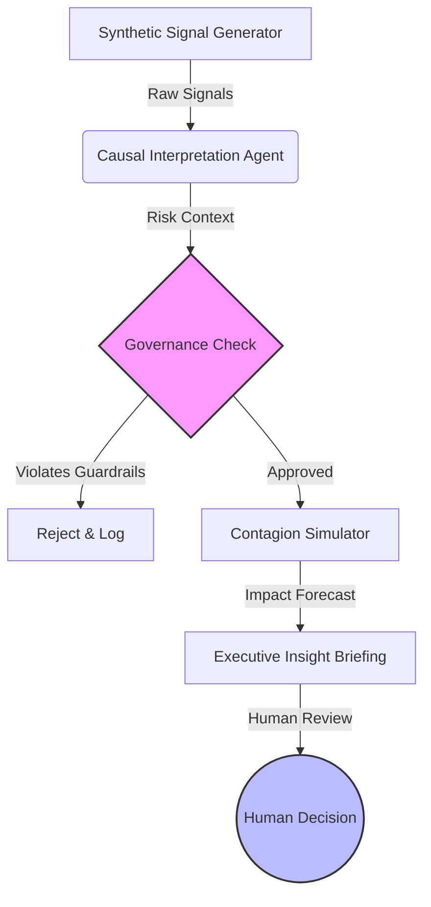

# Bank Reputational Stress-Test (BRST)

> **A "War Room" Simulator for Banking Resilience.**
> *An agentic system that detects signal, interprets risk, and forecasts impact—without compromising privacy.*

---

## Executive Summary
**BRST** is an AI-driven decision support system designed to interpret systemic risk rather than monitor individual behavior. Instead of reacting to real-time noise, BRST uses **Agent-Based Modeling** and **Causal Inference** to predict *why* a social signal matters and *how* it might impact bank operations (e.g., liquidity, call center volume, brand trust).

**Key Differentiation:**
* **No Real Scraping:** Operates entirely on synthetic data and aggregated social archetypes.
* **Operational Focus:** Maps sentiment directly to operational resilience metrics.
* **Governance First:** Built with hard-coded "non-action" boundaries and epistemic uncertainty checks.

---

## Key Features

### 1. The Causal Attribution Engine
Distinguishes between harmless noise and systemic threats using multi-agent reasoning.
* **Input:** Abstracted Social Signals (e.g., "Login Failure" rumor).
* **Process:** Evaluates signal against historical fraud patterns vs. technical outage logs.
* **Output:** Root Cause Probability Distribution (e.g., *80% Tech Issue, 20% Coordinated Attack*).

### 2. "Contagion Velocity" Simulator
A Monte Carlo simulation engine that forecasts the spread of misinformation across customer demographics.
* **Metric:** Calculates **Time-to-Criticality** (time until a signal reaches Tier-1 media).
* **Scenario Testing:** Allows leadership to simulate "What-If" responses (e.g., Silence vs. Transparency) to see which flattens the risk curve.

### 3. The Constitutional Guardrail Layer
* **Socratic Review:** The AI must answer 3 verification questions about its confidence level before a briefing is generated.
* **Zero-Action Protocol:** The system allows **zero** automated posting or public interaction.
* **Audit Trace:** Every inference step is logged for regulatory compliance.

---

## System Architecture



## Tech Stack

* **Core Logic:** Python 3.12+
* **Agent Orchestration:** Google Antigravity (Agentic Workflow)
* **Interface:** Streamlit
* **Data Strategy:** Synthetic JSON Signals & Archetypal Personas

---

## Repository Structure

```bash
├── data/
│   ├── synthetic_signals.json    # The "Trigger" signals (No real PII)
│   ├── social_archetypes.csv     # Abstracted demographic behaviors
├── src/
│   ├── agents/                   # Interpretation & Governance Agents
│   ├── simulator/                # Monte Carlo / Contagion Logic
│   └── ui/                       # Dashboard Interface
├── governance/
│   ├── ETHICS.md                 # Responsible AI Manifesto
│   └── guardrails.yaml           # Hard-coded constraints
├── tests/                        # Unit tests for logic verification
├── requirements.txt
└── README.md

```

## Responsible AI & Governance

We adhere to a strict **"Human-in-the-Loop" (HITL)** philosophy.

1. **Privacy First:** No PII (Personally Identifiable Information) is processed. All data is synthetic or aggregated.
2. **Uncertainty Quantification:** All predictions include an "Epistemic Uncertainty" score (0-100%) to prevent overconfidence.
3. **Explainability:** Every risk score is accompanied by a natural language explanation of the "Drivers" behind it.

---

## Getting Started

1. **Clone the Repo**
```bash
git clone [https://github.com/OverCh6rg3d/Bank-Reputational-Stress-Test.git](https://github.com/OverCh6rg3d/Bank-Reputational-Stress-Test.git)

```


2. **Install Dependencies**
```bash
pip install -r requirements.txt

```


3. **Run the Simulator**
```bash
streamlit run src/ui/dashboard.py

```


---

*Submitted for the Mashreq AI Hackathon 2025.*
