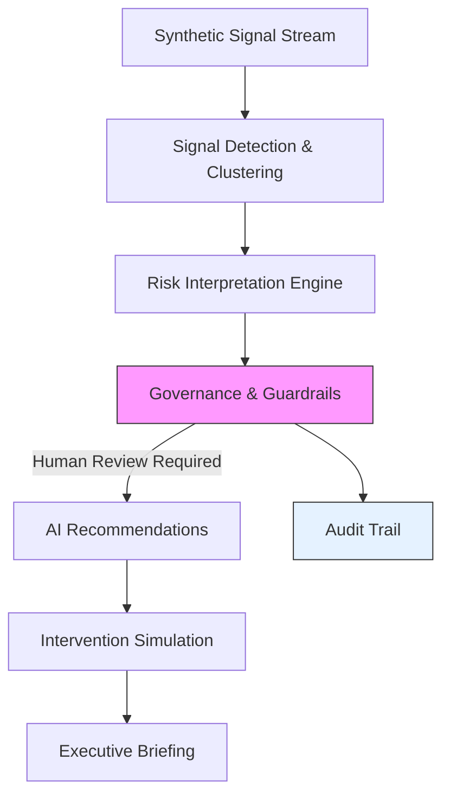
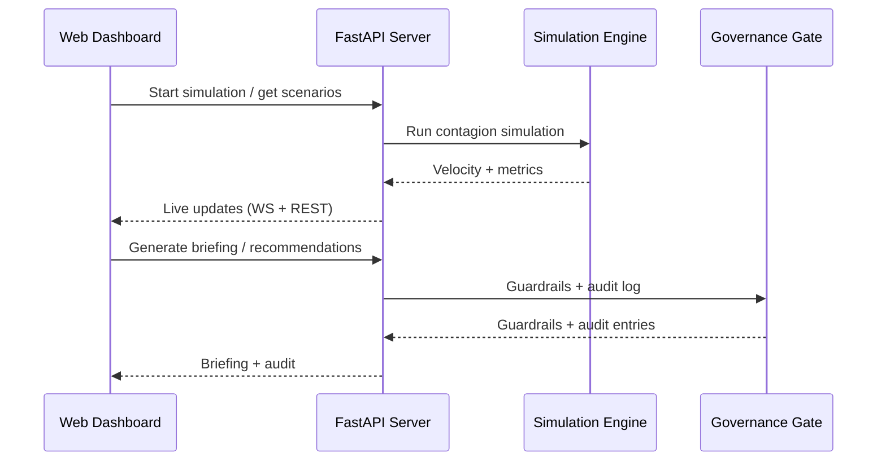

# Bank Reputational Stress-Test (BRST)

> **A responsible “war room” simulator for banking reputation risk.**
> Built for the Mashreq AI Hackathon challenge using synthetic signals, explainable reasoning, and human‑in‑the‑loop governance.

---

## Executive Summary
**BRST** is an AI‑assisted decision support system for interpreting **public social signals** without monitoring individuals or using real social data. It simulates how reputational signals might spread, quantifies risk with confidence/uncertainty, and enforces governance guardrails with human approval checkpoints.

**What makes it different**
- **No real social scraping**: all signals are synthetic and aggregated.
- **Explainability-first**: every signal and decision is traceable.
- **Governance embedded**: non‑action boundaries, escalation thresholds, and audit trails are built in.

---

## Product Capabilities (Aligned to Challenge Requirements)
- **Signal detection & aggregation**: synthetic social stream and clustering insights.
- **Risk & impact interpretation**: velocity, sentiment, alert thresholds, and scenario impact.
- **Explainable insights**: reasoning traces and debate‑based verification.
- **Confidence & uncertainty handling**: explicit confidence, escalation rules, and audit logging.
- **Human escalation & review workflows**: approval required before any strategy deployment.

---

## Dashboard Overview
Key panels in the UI:
- **Risk Trajectory**: 24‑hour simulation chart with velocity trends.
- **Live Signal Feed**: synthetic signal stream with sentiment and virality.
- **AI Recommendation**: strategy options with human approval and escalation.
- **Explainability**: reasoning trace + on‑demand cluster detection.
- **Executive Briefing**: C‑suite summary with risks, confidence, and impact.
- **Governance & Audit**: guardrails, thresholds, escalation paths, audit trail.
- **Adversarial Debate**: challenge AI findings to reduce hallucinations.

---

## System Architecture



### Request/Response Flow


---

## Tech Stack
- **Frontend**: Vite + React + Tailwind + Recharts
- **Backend**: FastAPI (REST + WebSocket)
- **AI**: OpenAI API (configurable)
- **Data**: Synthetic CSV/JSON datasets

---

## Repository Structure

```bash
data/
    scenario_definitions.json
    social_signals_stream.csv
    agent_archetypes.csv
    bank_knowledge_base.csv
governance/
    ETHICS.md
    guardrails.yaml
src/
    backend/                 # FastAPI backend (core engine + governance)
    api/                     # API server used by the dashboard
    simulator/               # Contagion model
    reporting/               # Executive briefing generator
    ui/web-app/              # React dashboard
tests/
requirements.txt
README.md
```

---

## Responsible AI & Governance
- **No PII / no live social data**: synthetic signals only.
- **Explicit uncertainty**: confidence thresholds trigger escalation.
- **Non‑action boundaries**: prohibits automated public action.
- **Human‑in‑the‑loop**: all strategies require human approval.
- **Audit trail**: decisions and rationale are recorded with scenario context.

---

## Setup & Run

### 1) Backend (API)
```bash
python -m venv .venv
source .venv/bin/activate
pip install -r requirements.txt

# Start API server
uvicorn api.server:app --reload --port 8000
```

### 2) Frontend (Dashboard)
```bash
cd src/ui/web-app
npm install
npm run dev
```

---

## Environment Variables
Create a `.env` at the repo root:

```env
OPENAI_API_KEY=your_key_here
```

Optional frontend override:

```env
VITE_API_BASE=http://localhost:8000
VITE_WS_BASE=ws://localhost:8000
```

---

## Demo Workflow
1. Select a scenario (all are **24 hours**).
2. Run simulation and observe velocity changes.
3. Review AI recommendation and optionally escalate.
4. Generate executive briefing.
5. Review governance guardrails and audit trail.
6. Reset to return to baseline.

---

## Notes
- This project uses **synthetic data only**, per hackathon constraints.
- The dashboard enforces **human‑approval** and **non‑action** boundaries.
- All scenarios are standardized to **24 hours** for consistent demos.

---

*Submitted for the Mashreq AI Hackathon 2025/2026.*
